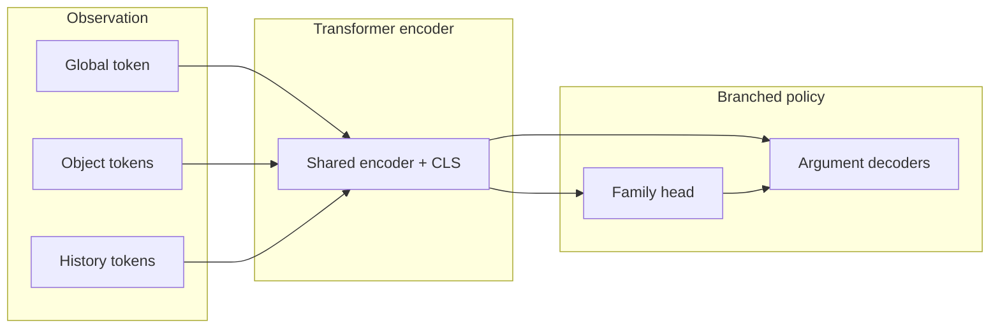

# Policy Transformer

**Status:** This approach has been abandoned — see [Going Forward](#going-forward).

This repository archives a **factorized hierarchical policy transformer** trained to imitate expert Balatro play. The model first picks an action family (e.g., `PlayHand`, `BuyShopItem`, `SkipBlind`), then predicts arguments like which cards or which shop slot.



## Performance

* The model chose the correct action from an expert demonstration with 74% accuracy and contained the correct decision within its top-3 actions 93% of the time, which was promising. However, in practice, it performed very poorly and was unable to pass the first blind consistently.
* This poor performance is almost certainly a direct drawback of *behavior cloning*. A traditional behavior-cloning training loop iterates over an expert dataset and minimizes a loss between the model's predicted action and the expert's demonstrated action for each state. The key insight is that the internal chain of thought, or *procedure*, that the expert used to arrive at an action is absent from the training process.
* This oversimplified architecture often leads to rapid overfitting and poor generalization, which is what was observed during the training process for the model presented in this repository.

Supporting offline metrics and dataset reports are under [`results/`](results/).

## Literature

* Many of these issues have already been addressed by several existing pieces of literature, including [Chain of Thought Imitation with Procedure Cloning](https://arxiv.org/abs/2205.10816), [Policy improvement by planning with Gumbel](https://openreview.net/forum?id=bERaNdoegnO), [Efficient Multi-agent Reinforcement Learning by Planning](https://openreview.net/forum?id=CpnKq3UJwp), and [Planning in stochastic environments with a learned model](https://openreview.net/forum?id=X6D9bAHhBQ1).

## Going Forward

* A different approach is needed in order to create an agent that is capable of playing or imitating the actions of an expert in an incomplete-information, stochastic, reasoning-heavy game.
* *Procedure cloning* is a promising alternative to *behavior cloning*, but it requires an expert dataset with procedure information for each state-action pair. One possibility is to reconstruct the procedure using MCTS.
* Alternatively, it might instead serve to use an expert dataset as a prior for an AlphaZero-style reinforcement-learning agent and fine-tune it using online reinforcement learning.
* A downside of these approaches is their heavy reliance on MCTS and, thus, the need for an efficient simulator and hardware to support the compute requirements.

## What's in this repo

A **readable extract** of the research code and design notes — not a turnkey training environment.

| Path                   | Contents                                          |
| ---------------------- | ------------------------------------------------- |
| [`src/`](src/)         | Model, loss, masks, training/eval entry points    |
| [`docs/`](docs/)       | Action space, state, masking, and pipeline design |
| [`configs/`](configs/) | Action maps, family specs, feature/vocab configs  |
| [`results/`](results/) | Compact reports behind the accuracy claims        |

```text
.
├── README.md
├── requirements.txt
├── src/           # policy transformer + training helpers
├── docs/          # human-oriented design notes
├── configs/       # small JSON contracts the model was built against
└── results/       # offline correctness & dataset summaries
```

The full local workspace (raw runs, tensor caches, checkpoints, live bridge, analytics, game source) is kept privately under `_local/` and is **not** part of this repository.
