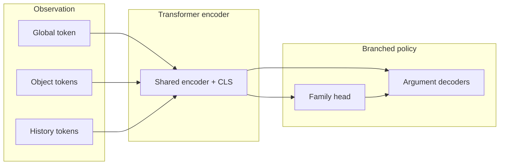

# Policy Transformer

**Status:** This approach has been abandoned — see [Going Forward](#going-forward).

This repository archives a **factorized hierarchical policy transformer** trained to imitate expert Balatro play. The model first picks an action family (e.g. `PlayHand`, `BuyShopItem`, `SkipBlind`), then predicts arguments like which cards or shop slot.



## Performance

- The model chose the correct action from an expert demonstration with 74% accuracy, and contained the correct decision within its top-3 actions 93% of the time, which was promising. However, in practice it performed very poorly, unable to pass the first blind with consistency.
- As it turns out, a decomposed action space leads to compounding errors, which is detrimental to long-run performance even over the course of a few actions.
- Furthermore, actions that are underrepresented (like `SELL_JOKER_9`) and that do not have strong corresponding signals will not be chosen by the model, despite using techniques like DAgger and logit adjustment.

Supporting offline metrics and dataset reports are under [`results/`](results/).

## Literature

- Many of these issues have already been addressed by AlphaZero, a chess, shogi, and go agent developed by Google DeepMind in 2017. The solution for reasoning-heavy tasks is to leverage compute using simulators and value estimators.
- This is in stark contrast to AlphaStar, Google DeepMind's StarCraft II agent, which used a factorized hierarchical policy transformer and a decomposed action space.

## Going Forward

- In order to create an agent that is capable of playing an incomplete-information, stochastic, reasoning-heavy game, we need to use a very different approach.
- Instead of having a model make decisions directly, we train state estimators based on expert demonstration and simulate the results of high-level actions.
- Based on the results of several simulations and value estimates of each one, we can determine an "optimal" path and avoid the pitfalls of compounding error.
- The downside is that this requires a very hardware-friendly simulator, which does not exist for Balatro. I am working on this.

## What's in this repo

A **readable extract** of the research code and design notes — not a turnkey training environment.

| Path | Contents |
|------|----------|
| [`src/`](src/) | Model, loss, masks, training / eval entrypoints |
| [`docs/`](docs/) | Action space, state, masking, and pipeline design |
| [`configs/`](configs/) | Action maps, family specs, feature / vocab configs |
| [`results/`](results/) | Compact reports behind the accuracy claims |

```text
.
├── README.md
├── requirements.txt
├── src/           # policy transformer + training helpers
├── docs/          # human-oriented design notes
├── configs/       # small JSON contracts the model was built against
└── results/       # offline correctness & dataset summaries
```

The full local workspace (raw runs, tensor caches, checkpoints, live bridge, analytics, game source) is kept privately under `_local/` and is **not** part of this repository.
